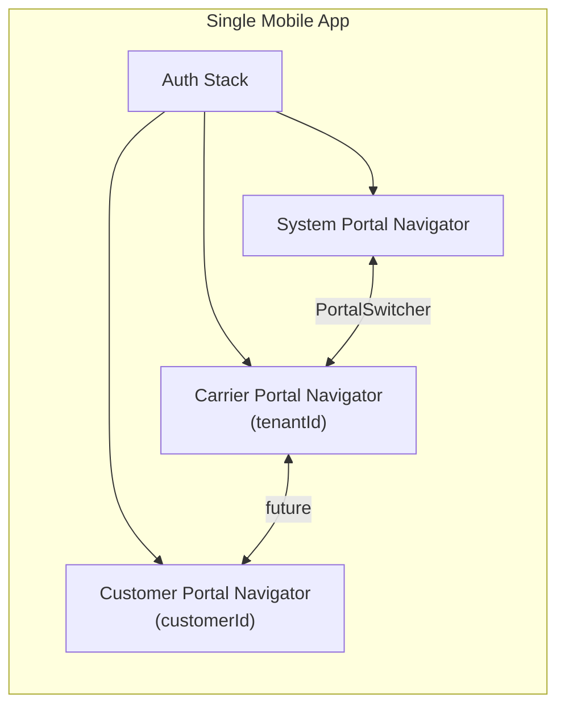
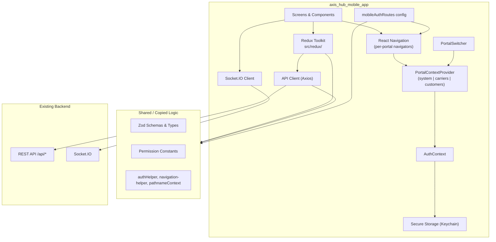
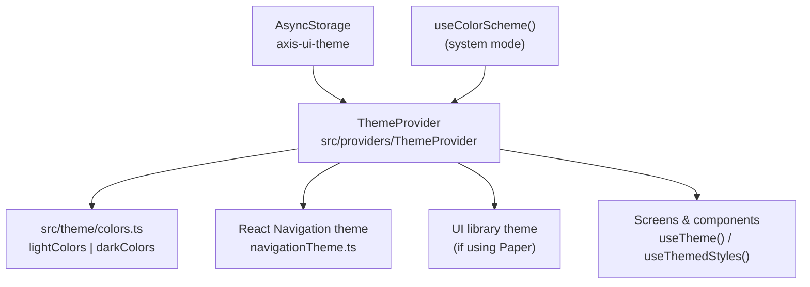

# Axis Hub Mobile App — Development Plan

This document outlines the strategy, architecture, and phased roadmap for building the Axis Hub mobile application as a companion to the existing React web application.

---

## Table of Contents

1. [Executive Summary](#executive-summary)
2. [Current State](#current-state)
3. [Goals & Non-Goals](#goals--non-goals)
4. [Multi-Portal Architecture](#multi-portal-architecture)
5. [Target Users & Use Cases](#target-users--use-cases)
6. [Architecture Overview](#architecture-overview)
7. [Recommended Tech Stack](#recommended-tech-stack)
8. [Project Structure](#project-structure)
9. [Source Layout (`src/`)](#source-layout-src)
10. [Theming (Light & Dark Mode)](#theming-light--dark-mode)
11. [Redux Toolkit (`src/redux/`)](#redux-toolkit-srcredux)
12. [Shared Code Strategy](#shared-code-strategy)
13. [Web-to-Mobile Mapping](#web-to-mobile-mapping)
14. [Phased Implementation Roadmap](#phased-implementation-roadmap)
15. [Step-by-Step Workflow](#step-by-step-workflow)
16. [Module Priority Matrix](#module-priority-matrix)
17. [Authentication & Session](#authentication--session)
18. [API & State Management](#api--state-management)
19. [Navigation Design](#navigation-design)
20. [UI/UX Guidelines](#uiux-guidelines)
21. [Realtime, Offline & Push](#realtime-offline--push)
22. [Testing Strategy](#testing-strategy)
23. [Build, Release & CI/CD](#build-release--cicd)
24. [Risks & Mitigations](#risks--mitigations)
25. [Success Criteria](#success-criteria)
26. [Appendix: Web App Reference](#appendix-web-app-reference)

---

## Executive Summary

The Axis Hub web application is a large, multi-portal logistics platform (System Admin, Carrier/Tenant, and planned Customer portals) built with React 19, Redux Toolkit, and a REST + Socket.IO backend. The mobile app (`axis_hub_mobile_app`) is currently a **fresh React Native 0.85.3 scaffold** with no navigation, API integration, or shared code.

**Recommended approach:** Build **one mobile app with multiple portals** (System, Carrier/Tenant, Customer) — mirroring the web's `authRoutes` model in `AppRoutes.tsx`. Roll out feature screens **portal by portal** (System → Carrier → Customer) rather than a 1:1 port of all ~650 web pages. Reuse API contracts, Zod schemas, permission logic, and route metadata from the web app.

**Portal architecture detail:** See [PORTAL_ARCHITECTURE.md](./PORTAL_ARCHITECTURE.md).

**How we build:** One checklist item at a time → implement → verify → mark `- [x]` when done. See [Step-by-Step Workflow](#step-by-step-workflow).

**Estimated overall effort:** Large (multi-sprint). Phase 1 (foundation + auth) is achievable in 2–4 weeks; full operational coverage spans multiple quarters depending on team size and scope.

---

## Current State

### Web Application (`frontend/`)

| Area | Details |
|------|---------|
| Entry | `frontend/src/main.tsx` — Redux, BrowserRouter, ThemeProvider, AuthContext, GlobalOverlay |
| Routing | `frontend/src/routes/AppRoutes.tsx` (~3,100 lines), permission-gated nested routes |
| State | Redux Toolkit — ~58 slices, ~59 action files |
| API | Axios via `frontend/src/utils/axiosApi.ts`, base URL from `envConfig` |
| Auth | JWT in cookies (`auth_token`), `AuthContextProvider`, profile + tenant context |
| Realtime | Socket.IO (`frontend/src/realtime/socketManager.ts`) |
| UI | shadcn/ui (Radix + Tailwind), MUI Data Grid, Kendo Grid |
| Schemas | ~60 Zod/TS files in `frontend/src/schemaTypes/` |
| Version | `2.0.27` (from `package.json`) |

### Mobile Application (`axis_hub_mobile_app/`)

| Area | Details |
|------|---------|
| Entry (current) | `index.js` → root `App.tsx` (scaffold) |
| Entry (target) | `index.js` → `src/app/App.tsx` |
| Source root | **`src/`** — all application code lives here |
| RN Version | 0.85.3, React 19.2.3 |
| Dependencies | `react-native-safe-area-context`, `@react-native/new-app-screen` only |
| Navigation | None |
| Theming | None (scaffold uses `useColorScheme()` for StatusBar only) |
| API / Auth | None |
| Shared code | None with `frontend/` or `backend/` |
| Docs | `docs/MOBILE_APP_DEVELOPMENT_PLAN.md`, `docs/PORTAL_ARCHITECTURE.md` |

### Provider Parity (Web → Mobile)

| Web (`main.tsx`) | Mobile Equivalent (planned) |
|------------------|---------------------------|
| `Provider` (Redux) | `Provider` from `react-redux` + `src/redux/store.ts` |
| `BrowserRouter` | React Navigation (native stack + tabs) |
| `ThemeProvider` | `src/providers/ThemeProvider` — light / dark / system |
| `AuthContextProvider` | `AuthContextProvider` (ported logic) |
| `GlobalOverlayProvider` | Modal / bottom sheet manager |
| `Toaster` (sonner) | `react-native-toast-message` or similar |

---

## Goals & Non-Goals

### Goals

- Deliver a **single native iOS and Android app** with **multiple portals** (System, Carrier, Customer) in one binary — same model as the web SPA.
- **Reuse the existing backend API** — no mobile-specific API layer unless required.
- Match web app **auth, permissions, portal context, and tenant switching** behavior.
- Support **portal switching** (Admin ↔ Carrier, tenant selection) equivalent to web navbar.
- Support **real-time updates** for operational data (orders, load board) where the web app uses Socket.IO.
- Establish a **route-config-driven** structure that mirrors `authRoutes` / `AuthRoute` from web.
- Use **Redux Toolkit** in `src/redux/` for state — same slice/action pattern as web.
- Support **light and dark mode** with user preference persistence (aligned with web `ThemeProvider`).
- Organize all application code under **`src/`** — matching the web app's `frontend/src/` convention.

### Non-Goals (initial releases)

- Full parity with every screen in every portal on day one.
- Full parity with all Master Data CRUD screens (vehicles, invoice templates, etc.) — web remains primary for heavy data entry.
- Replacing the web app for desk-based power users.
- Offline-first sync for all entities (evaluate per phase).

---

## Multi-Portal Architecture

The web app treats **System**, **Carrier (Tenant)**, and **Customer** as separate portals inside one application. URL prefixes determine the active portal:

| Portal | Web prefix | `PortalContext` | Entity param |
|--------|------------|-----------------|--------------|
| Admin | `/system/*` | `system` | — |
| Carrier | `/carriers/:carrierId/*` | `carriers` | `tenantId` |
| Customer | `/customers/:customerId/*` | `customers` | `customerId` |

**Web sources:** `frontend/src/routes/AppRoutes.tsx` (`authRoutes`), `frontend/src/utils/pathnameContext.ts`, `frontend/src/components/Layouts/sidebar.tsx`, `frontend/src/components/Layouts/navbar.tsx`.

### Mobile approach

Instead of URL paths, mobile uses **`PortalContextProvider`** state (`portalContext`, `tenantId`, `customerId`) plus React Navigation. A single **`mobileAuthRoutes`** config mirrors web `authRoutes` metadata (permissions, titles, sidebar visibility). One portal navigator is active at a time; switching portals resets navigation state (same as web hard refresh on tenant change).



**Full design:** [PORTAL_ARCHITECTURE.md](./PORTAL_ARCHITECTURE.md)

---

## Target Users & Use Cases

| Persona | Portal | Primary mobile needs |
|---------|--------|---------------------|
| **Platform admin** | System | Carrier list, compliance status, system dashboard |
| **Dispatcher / Ops manager** | Carrier | Load orders (inbox → dispatch → delivered), status changes |
| **Driver / Owner-operator** | Carrier | Assigned loads, settlement summaries, onboarding |
| **Brokerage coordinator** | Carrier | Load board inbox, carrier lane/rate lookups |
| **Customer user** | Customer | Order status, documents (when portal ships on web) |

System Master CRUD and invoice template design remain **web-first** even when the System portal exists on mobile.

---

## Architecture Overview



### Key principles

1. **Single app, multiple portals** — Same entity model as web (`system`, `carriers`, `customers`).
2. **API-first** — Mobile consumes the same REST endpoints as web (`/api/auth/*`, `/api/tenants/{tenantId}/*`).
3. **Route-config driven** — `mobileAuthRoutes` mirrors `authRoutes`; navigators generated from config.
4. **Permission-gated navigation** — Mirror `RouteGuardRenderer` + `filterRoutesByAuthorization`.
5. **Tenant-scoped context** — Active `tenantId` drives API paths and socket handshake, matching web `pathnameContext` + navbar tenant sync.

---

## Recommended Tech Stack

| Layer | Recommendation | Rationale |
|-------|----------------|-----------|
| Framework | React Native 0.85.3 (current) | Already scaffolded; aligns with React 19 web stack |
| Language | TypeScript | Matches web; strict typing for API contracts |
| Navigation | `@react-navigation/native` + native-stack + bottom-tabs | Industry standard; maps to web's nested routes |
| Gestures / Screens | `react-native-screens`, `react-native-gesture-handler`, `react-native-reanimated` | Required by React Navigation |
| State (client + server) | **Redux Toolkit** + `createAsyncThunk` in `src/redux/actions/` | Same pattern as web; port slices incrementally |
| State persistence | **redux-persist** + AsyncStorage | Web uses localStorage; mobile uses `@react-native-async-storage/async-storage` |
| HTTP | Axios | Same client patterns as `axiosApi.ts` |
| Auth storage | `react-native-keychain` or `expo-secure-store` | Replace `js-cookie` for JWT |
| Forms | `react-hook-form` + `@hookform/resolvers/zod` | Same as web |
| Validation | Zod | Share or copy from `schemaTypes/` |
| Theming | Custom `ThemeProvider` + design tokens in `src/theme/` |
| UI components | **React Native Paper** (themed via `ThemeProvider`) or custom `src/components/ui/` |
| Icons | `react-native-vector-icons` or `lucide-react-native` | Match web lucide icons where possible |
| Toasts | `react-native-toast-message` | Replaces sonner |
| Realtime | `socket.io-client` | Same as web; may need polyfills |
| Maps | `react-native-maps` | Replaces `@react-google-maps/api` |
| Env config | `react-native-config` or `react-native-dotenv` | Mirror `envConfig.ts` Zod validation |
| Testing | Jest + React Native Testing Library | Already in scaffold |
| E2E (later) | Detox or Maestro | Device-level flows |

---

## Project Structure

All application source code lives under **`src/`**. Native project folders (`android/`, `ios/`) and config at the repo root stay outside `src/`, matching the web app's split (`frontend/src/` vs Vite config at `frontend/` root).

```
axis_hub_mobile_app/
├── index.js                    # Entry — registers App from src/
├── app.json
├── package.json
├── tsconfig.json
├── babel.config.js
├── metro.config.js
├── android/                    # Native Android (unchanged)
├── ios/                        # Native iOS (unchanged)
├── docs/
│   ├── MOBILE_APP_DEVELOPMENT_PLAN.md
│   └── PORTAL_ARCHITECTURE.md
└── src/                        # ★ All application code here
    ├── app/
    ├── navigation/
    ├── screens/
    ├── components/
    ├── contexts/
    ├── providers/
    ├── redux/
    ├── theme/
    ├── api/
    ├── hooks/
    ├── schemaTypes/
    ├── utils/
    └── config/
```

**Root files kept outside `src/`:** `index.js`, `app.json`, `package.json`, Metro/Babel/Jest/ESLint config, `android/`, `ios/`, `__tests__/` (or move tests beside modules under `src/` later).

---

## Source Layout (`src/`)

### Convention

| Rule | Detail |
|------|--------|
| **Single source root** | Every `.ts` / `.tsx` app file goes under `src/` |
| **Path alias** | `@/` → `src/` (tsconfig + Babel `module-resolver`) |
| **Entry** | `index.js` imports `src/app/App.tsx` |
| **No root `App.tsx`** | Remove scaffold `App.tsx` from project root after migration |
| **Redux** | `src/redux/` — `store.ts`, `slices/`, `actions/` (mirror web layout) |
| **Screens by portal** | `src/screens/system/`, `carrier/`, `customer/`, `auth/` |
| **Shared UI** | `src/components/ui/` — theme-aware primitives |

### Full `src/` tree

```
src/
├── app/
│   ├── App.tsx                     # Root component (providers + RootNavigator)
│   └── providers/
│       └── AppProviders.tsx        # Composes all providers
├── providers/
│   └── ThemeProvider/
│       ├── index.tsx               # Theme context (light | dark | system)
│       └── useTheme.ts
├── theme/
│   ├── index.ts                    # Re-exports tokens + helpers
│   ├── colors.ts                   # lightColors, darkColors
│   ├── tokens.ts                   # spacing, radius, typography
│   ├── navigationTheme.ts          # React Navigation light/dark themes
│   └── types.ts                    # Theme, ColorScheme, ThemeTokens
├── navigation/
│   ├── RootNavigator.tsx
│   ├── AuthNavigator.tsx
│   ├── portals/
│   │   ├── SystemPortalNavigator.tsx
│   │   ├── CarrierPortalNavigator.tsx
│   │   └── CustomerPortalNavigator.tsx
│   ├── routes/
│   │   ├── types.ts
│   │   ├── systemRoutes.ts
│   │   ├── carrierRoutes.ts
│   │   ├── customerRoutes.ts
│   │   └── index.ts
│   ├── guards/
│   │   └── PortalGuard.tsx
│   ├── PortalContextProvider.tsx
│   ├── PortalSwitcher.tsx
│   ├── buildPortalNavigator.tsx
│   └── linking.ts
├── screens/
│   ├── auth/
│   ├── system/
│   ├── carrier/
│   └── customer/
├── components/
│   ├── ui/                         # Themed Button, Input, Card, etc.
│   └── layouts/
│       ├── PortalShell.tsx         # Header + drawer + theme-aware chrome
│       └── ScreenContainer.tsx
├── contexts/
│   └── AuthContextProvider.tsx
├── redux/
│   ├── store.ts                    # configureStore, persist, typed hooks
│   ├── slices/
│   │   ├── authSlice.ts            # user, tenants, currentTenant (store key: user)
│   │   ├── uiPreferencesSlice.ts
│   │   ├── filterSlice.ts
│   │   ├── orderSlice.ts           # port per feature phase
│   │   └── ...
│   └── actions/
│       ├── authActions.ts
│       ├── orderActions.ts
│       └── ...
├── api/
│   ├── axiosApi.ts
│   └── authApi.ts
├── hooks/
│   └── useThemedStyles.ts          # Optional: typed styles from theme
├── schemaTypes/
├── utils/
├── config/
│   └── envConfig.ts
└── types/
    └── global.d.ts
```

### Entry point wiring

**`index.js`** (project root):

```javascript
import { AppRegistry } from 'react-native';
import App from './src/app/App';
import { name as appName } from './app.json';

AppRegistry.registerComponent(appName, () => App);
```

**`src/app/App.tsx`** — provider stack (mirrors web `main.tsx`):

```tsx
import { Provider } from 'react-redux';
import { PersistGate } from 'redux-persist/integration/react';
import { store, persistor } from '@/redux/store';

<SafeAreaProvider>
  <Provider store={store}>
    <PersistGate loading={null} persistor={persistor}>
      <ThemeProvider defaultTheme="system" storageKey="axis-ui-theme">
        <AppProviders>
          <RootNavigator />
        </AppProviders>
      </ThemeProvider>
    </PersistGate>
  </Provider>
</SafeAreaProvider>
```

### Tooling updates (Phase 0)

| File | Change |
|------|--------|
| `tsconfig.json` | `"baseUrl": "."`, `"paths": { "@/*": ["src/*"] }` |
| `babel.config.js` | `babel-plugin-module-resolver` with alias `@` → `./src` |
| `metro.config.js` | Ensure `src/` is watched (default) |
| `jest.config.js` | `moduleNameMapper` for `@/` alias |
| `__tests__/App.test.tsx` | Import from `src/app/App` |

---

## Theming (Light & Dark Mode)

The mobile app **must support light and dark mode**, aligned with the web app's `ThemeProvider` (`frontend/src/providers/ThemeProvider/index.tsx`).

### Theme modes

| Mode | Behavior |
|------|----------|
| **`light`** | Always use light palette |
| **`dark`** | Always use dark palette |
| **`system`** | Follow OS `useColorScheme()` (default, same as web) |

User preference is persisted to **AsyncStorage** under key `axis-ui-theme` (web uses `vite-ui-theme` in localStorage).

### Architecture



### `src/theme/` files

| File | Purpose |
|------|------|
| `colors.ts` | Semantic colors for light and dark (background, foreground, primary, border, card, destructive, muted, sidebar, etc.) — align with web CSS variables where possible |
| `tokens.ts` | Spacing, border radius, font sizes, font weights |
| `navigationTheme.ts` | `@react-navigation/native` `DefaultTheme` / `DarkTheme` overrides using app colors |
| `types.ts` | `type Theme = 'light' \| 'dark' \| 'system'`, `ThemeTokens` interface |

### `ThemeProvider` API (mirror web)

```typescript
type Theme = 'light' | 'dark' | 'system';

interface ThemeContextValue {
  theme: Theme;                              // user preference
  resolvedTheme: 'light' | 'dark';           // actual applied scheme
  setTheme: (theme: Theme) => void;
  colors: ThemeTokens;                     // active palette
}
```

### Platform integration

| Concern | Implementation |
|---------|----------------|
| **StatusBar** | `barStyle={resolvedTheme === 'dark' ? 'light-content' : 'dark-content'}` |
| **Navigation** | Pass themed object to `NavigationContainer` `theme` prop |
| **Safe areas** | Unchanged; backgrounds use `colors.background` |
| **Settings toggle** | Carrier portal Settings screen — Light / Dark / System (same UX as web) |
| **Splash / native** | Optional: sync iOS `UIUserInterfaceStyle` / Android `DayNight` in a later phase |

### Usage in components

```tsx
import { useTheme } from '@/providers/ThemeProvider';

function OrderCard() {
  const { colors, resolvedTheme } = useTheme();

  return (
    <View style={{ backgroundColor: colors.card, borderColor: colors.border }}>
      <Text style={{ color: colors.foreground }}>...</Text>
    </View>
  );
}
```

Prefer **semantic token names** (`colors.primary`, `colors.mutedForeground`) over hardcoded hex in screens.

### Web parity reference

| Web | Mobile |
|-----|--------|
| `ThemeProvider` in `main.tsx` | `ThemeProvider` in `src/app/App.tsx` |
| `defaultTheme="light"` on web | `defaultTheme="system"` on mobile (recommended) |
| `storageKey="vite-ui-theme"` | `storageKey="axis-ui-theme"` |
| Tailwind `dark:` classes | `resolvedTheme` + `colors` object |
| `useTheme()` hook | Same hook name in `src/providers/ThemeProvider` |

---

## Redux Toolkit (`src/redux/`)

State management uses **Redux Toolkit**, matching the web app's `frontend/src/redux/` layout. API calls live in **async thunks** (`src/redux/actions/`), not a separate services layer — same convention as web.

### Folder structure

```
src/redux/
├── store.ts                 # configureStore, combineReducers, persist, typed hooks
├── slices/
│   ├── authSlice.ts         # Registered as `user` in store (matches web)
│   ├── uiPreferencesSlice.ts
│   ├── filterSlice.ts
│   ├── orderSlice.ts
│   ├── inboxSlice.ts
│   └── ...                  # Port additional slices per feature phase
└── actions/
    ├── authActions.ts       # signInUser, logoutUser, fetchSignedInUserProfile, fetchTenants
    ├── orderActions.ts
    ├── commonActions.ts     # Shared helpers (e.g. export)
    └── ...
```

### `store.ts` (mirror web)

| Piece | Web | Mobile |
|-------|-----|--------|
| Store setup | `configureStore` + `combineReducers` | Same |
| Persistence | `redux-persist` + `localStorage` | `redux-persist` + **AsyncStorage** |
| Typed hooks | `useAppDispatch`, `useAppSelector` | Same names in `src/redux/store.ts` |
| Serializable check | Ignore `PERSIST`, `REHYDRATE`, etc. | Same |
| Purge on logout | `persistor.purge()` | Same |

```typescript
// src/redux/store.ts — pattern
import AsyncStorage from '@react-native-async-storage/async-storage';
import { configureStore, combineReducers } from '@reduxjs/toolkit';
import { persistStore, persistReducer, FLUSH, REHYDRATE, PAUSE, PERSIST, PURGE, REGISTER } from 'redux-persist';

const persistConfig = {
  key: 'root',
  storage: AsyncStorage,
  whitelist: [], // expand as needed (e.g. uiPreferences, filter)
};

export const store = configureStore({ /* ... */ });
export const persistor = persistStore(store);
export const useAppDispatch = useDispatch.withTypes<AppDispatch>();
export const useAppSelector = useSelector.withTypes<RootState>();
```

### Slice + action pattern (same as web)

1. **Actions** — `createAsyncThunk` in `src/redux/actions/{domain}Actions.ts` calls `getAxios()` from `src/utils/axiosApi.ts`
2. **Slices** — `createSlice` in `src/redux/slices/{domain}Slice.ts` handles `extraReducers` for thunk lifecycle
3. **Screens** — `useAppDispatch` + `useAppSelector`; dispatch thunks from components (web CRUD colocalization pattern)

### Phase 0–1 slices (minimum)

| Store key | Slice file | Purpose |
|-----------|------------|---------|
| `user` | `authSlice.ts` | `loggedInUser`, `tenants`, `currentTenant`, auth loading/error |
| `uiPreferences` | `uiPreferencesSlice.ts` | UI state (optional early) |
| `filter` | `filterSlice.ts` | List filters (when lists ship) |

Additional slices (`order`, `inbox`, `loadRequest`, etc.) are added in feature phases — copy from `frontend/src/redux/slices/` and adapt imports.

### Dependencies (Phase 0)

```json
"@reduxjs/toolkit": "^2.x",
"react-redux": "^9.x",
"redux-persist": "^6.x",
"@react-native-async-storage/async-storage": "^2.x"
```

### Integration with Auth & portals

- `AuthContextProvider` orchestrates session UI; **auth data** lives in Redux `user` slice (same split as web)
- `PortalSwitcher` reads `currentTenant` from `state.user` via `useAppSelector`
- Tenant switch dispatches `setCurrentTenant` from `authSlice` (port from web)
- Axios 401 interceptor dispatches `logoutUser` thunk

### Porting strategy

| Phase | Redux work |
|-------|------------|
| **0** | `store.ts`, `authSlice`, `authActions`, Provider + PersistGate |
| **1** | Wire login/logout/profile thunks; purge persist on logout |
| **2** | `uiPreferencesSlice` if needed |
| **3+** | Port `orderSlice`, `inboxSlice`, `orderActions`, etc. per module |

Do **not** port all ~58 web slices upfront. Add slices when the corresponding mobile screens are built.

**Web reference:** `frontend/src/redux/store.ts`, `frontend/docs/CRUD-IMPLEMENTATION-GUIDE-V2.md`

---

## Shared Code Strategy

The mobile app is currently a **standalone** npm project (no monorepo workspace). Three options:

| Option | Pros | Cons | Recommendation |
|--------|------|------|----------------|
| **A. Copy & sync manually** | Simplest; no tooling changes | Drift risk | Start here for Phase 0–1 |
| **B. Monorepo package (`packages/shared`)** | Single source of truth for schemas, permissions, API types | Requires repo restructure | Target for Phase 2+ |
| **C. Symlinks / path imports to `frontend/src`** | Fast reuse | Breaks Metro bundler; RN incompatible imports | **Avoid** |

### High-value shared artifacts (copy or extract to shared package)

| Web path | Mobile use |
|----------|------------|
| `frontend/src/schemaTypes/*` | Form validation, API response typing |
| `frontend/src/utils/authHelper.ts` | Permission checks |
| `frontend/src/utils/constants/*` | Permission key names |
| `frontend/src/utils/navigation-helper.ts` | Post-login routing, route filtering |
| `frontend/src/utils/pathnameContext.ts` | Portal context types and resolution |
| `frontend/src/routes/AppRoutes.tsx` | Route metadata reference for `mobileAuthRoutes` |
| `frontend/src/redux/store.ts` | Store setup, slice registration pattern |
| `frontend/src/redux/slices/*` | Port slices incrementally |
| `frontend/src/redux/actions/*` | Thunk + API endpoint reference |

### Not portable as-is

| Web | Mobile replacement |
|-----|-------------------|
| `js-cookie` | Secure async storage |
| `import.meta.env` | `react-native-config` |
| shadcn / Radix / MUI / Kendo | Native UI components |
| `BrowserRouter` / URL pathname | `PortalContextProvider` + React Navigation state |
| `GlobalOverlayProvider` | React Navigation modals / bottom sheets |
| CSS / Tailwind classes | StyleSheet or NativeWind |

---

## Web-to-Mobile Mapping

### Portal mapping

All three portals live in **one mobile app**. Screens roll out incrementally; portal shells and route config should exist from Phase 2.

| Web portal | `PortalContext` | Mobile navigator | Initial scope |
|------------|-----------------|------------------|---------------|
| `/login` | — | `AuthStack` | Phase 1 |
| `/system/*` | `system` | `SystemPortalNavigator` | Phase 3 (feature screens) |
| `/carriers/:carrierId/*` | `carriers` | `CarrierPortalNavigator` | Phase 4 (feature screens) |
| `/customers/:customerId/*` | `customers` | `CustomerPortalNavigator` | Phase 5 (details TBD) |

### System portal modules (web reference)

| Module | Web path | Mobile phase |
|--------|----------|--------------|
| Dashboard | `/system/dashboard` | Phase 3.1 |
| Carriers | `/system/carriers/*` | Phase 3.2 |
| Customers (system) | `/system/customers/*` | Phase 3.3 |
| System Master | `/system/master/*` | Phase 3.4 |
| System Secrets | `/system/secrets` | Phase 3.5 |

### Carrier portal modules (web reference)

| Web module | Web path pattern | Mobile v1 | Mobile v2+ |
|------------|------------------|-----------|------------|
| Dashboard | `.../dashboard` | Summary cards, KPIs | Charts, widgets |
| Load Orders | `.../load-orders` | Phase 4.1 — Inbox, Dispatch, Delivered lists + detail | Planning, Complete, History |
| Load Requests | `.../load-requests` | Phase 4.2 — List + detail (read) | Create/edit |
| Brokerage / Load Board | `.../brokerage` | Phase 4.2 — Inbox list | Full board workflow |
| Billing / Invoicing | `.../billing` | Phase 4.3 — Invoice status lists | Full billing |
| Settlement | `.../billing/settlement` | Phase 4.3 — Driver settlement view | O/O settlement |
| Onboarding | `.../onboarding` | Phase 4.4 — Driver task list | Document upload |
| Master (Users, Assets, etc.) | `.../master/*` | — | Phase 6+ selective read-only lookups |
| Fuel, FSC, Materials | `.../fuel`, `.../fsc`, `.../materials` | — | Phase 6+ as needed |
| Settings | `.../settings` | Profile, logout, theme (Phase 2) | Full settings |

---

## Phased Implementation Roadmap

Use the checkboxes below as the **single source of truth** for progress. Work in phase order (0 → 1 → 2 → …). Update [Phase Progress](#phase-progress) when you mark items done.

### Phase progress

| Phase | Name | Status | Done |
|-------|------|--------|------|
| **0** | Foundation | Complete | 17 / 17 |
| **1** | Authentication & Session | Complete | 11 / 12 |
| **2** | Multi-Portal Shell | Complete | 10 / 10 |
| **3** | System Portal Feature Screens | Not started | 0 / 13 |
| **4** | Carrier Portal Feature Screens | Not started | 0 / 15 |
| **5** | Customer Portal Feature Screens | Not started | 0 / 0 |
| **6** | Polish & Release | Not started | 0 / 7 |

**Current focus:** Phase 3 — System Portal Feature Screens (start with Phase 3.1 Dashboard).

---

### Phase 0 — Foundation (Week 1–2)

**Objective:** Create `src/` layout, theme system, and production-ready app shell.

- [x] Create full `src/` folder structure (see [Source Layout](#source-layout-src))
- [x] Move app entry: delete root `App.tsx`, add `src/app/App.tsx`, update `index.js`
- [x] Configure `@/` path alias in `tsconfig.json`, Babel, and Jest
- [x] Install core dependencies (navigation, axios, **Redux Toolkit**, redux-persist, AsyncStorage, secure storage, UI kit)
- [x] Add `src/redux/store.ts`, `src/redux/slices/authSlice.ts`, `src/redux/actions/authActions.ts`
- [x] Wire `Provider` + `PersistGate` in `src/app/App.tsx`
- [x] Add `src/config/envConfig.ts` with Zod validation (mirror web pattern)
- [x] Implement `src/utils/axiosApi.ts` with auth interceptor (port from web `axiosApi.ts`)
- [x] **Theming:** add `src/theme/` (colors, tokens, navigationTheme)
- [x] **Theming:** implement `src/providers/ThemeProvider` (light / dark / system + AsyncStorage)
- [x] Wire `ThemeProvider` in `src/app/App.tsx`; themed `NavigationContainer`
- [x] StatusBar follows `resolvedTheme`
- [x] Define `MobileAuthRoute` type and stub `mobileAuthRoutes` (three portal roots)
- [x] Add `PortalContextProvider` (portal state only; full switching in Phase 2)
- [x] Remove `NewAppScreen` template; add themed placeholder home screen
- [x] Add `.env.sample` for `API_BASE_URL`, app env
- [x] Document local run instructions in `docs/RUN_GUIDE.md`

**Deliverable:** App launches from `src/` on iOS/Android with working light/dark/system theme and configured API client.

---

### Phase 1 — Authentication & Session (Week 2–4)

**Objective:** Users can log in and stay authenticated.

- [x] Port `AuthContextProvider` logic from web
- [x] Login screen (email/password) — mirror `LoginPage.tsx`
- [x] `POST /api/auth/signin` integration
- [x] Store JWT in Keychain/Keystore (not AsyncStorage alone)
- [x] Session restore on app launch — `GET /api/auth/profile`
- [x] 401 handling → logout + redirect to login
- [x] Auth navigator vs. app navigator (logged out / logged in)
- [x] `PortalContextProvider`: persist `portalContext`, `tenantId`, `customerId`
- [x] Port `getDefaultRouteForUser` — route user to correct portal after login
- [x] Tenant context: sync `activeTenantId`, pass to profile and API calls
- [x] Permission helper — port `checkAuthorization` and `filterRoutesByAuthorization`
- [x] Logout flow
- [ ] (Optional) Google OAuth via deep link / in-app browser

**Deliverable:** End-to-end login, session persistence, logout, correct portal destination on login.

---

### Phase 2 — Multi-Portal Shell (Week 4–6)

**Objective:** Authenticated users enter the correct portal with switchable context — mirroring web sidebar + navbar.

- [x] `SystemPortalNavigator`, `CarrierPortalNavigator`, `CustomerPortalNavigator` (customer: placeholder)
- [x] `buildPortalNavigator()` — generate stacks from `mobileAuthRoutes`
- [x] `PortalSwitcher` — Admin ↔ Carrier switch, tenant dropdown (mirror `navbar.tsx`)
- [x] Per-portal drawer/menu from `isShowOnSidebar` routes (mirror `sidebar.tsx`)
- [x] `PortalGuard` on all authenticated screens
- [x] Placeholder screens for each portal's top-level modules
- [x] Carrier dashboard screen — key metrics
- [x] Profile / settings screen (user info, **theme selector: Light / Dark / System**, logout)
- [x] Toast notifications for API errors/success
- [x] Connect Socket.IO on auth (port `socketManager.ts` patterns)

**Deliverable:** User sees correct portal, can switch portals/tenants (if permitted), and navigate module menu.

---

### Phase 3 — System Portal Feature Screens (Week 6–12)

**Objective:** System admins can monitor and manage platform-level data from mobile. Read-focused views first; full CRUD remains web-first unless noted.

Phase 3 is split into sub-phases by system module. Complete each sub-phase before moving to the next unless a dependency note says otherwise.

#### Phase 3.1 — System Dashboard

- [ ] Replace placeholder with live KPI cards (read-only metrics aligned with web `/system/dashboard`)
- [ ] Pull-to-refresh on dashboard data
- [ ] Loading, empty, and error states with toasts

**Reference web paths:**
- `frontend/src/pages/System/Dashboard/` (or equivalent system dashboard pages)

**Deliverable:** System user sees real admin dashboard KPIs on mobile.

#### Phase 3.2 — System Carriers

- [ ] Carrier list (paginated, pull-to-refresh, search)
- [ ] Carrier detail summary screen (read-only key fields)
- [ ] Navigate from carrier detail → open Carrier portal for that tenant (`switchToCarrierPortal`)

**Reference web paths:**
- `frontend/src/pages/System/Carrier/`
- Related Redux slices/actions for system carrier list

**Deliverable:** System user can browse carriers and jump into a carrier tenant portal.

#### Phase 3.3 — System Customers

- [ ] System-level customer list (paginated, read-first)
- [ ] Customer detail summary (read-only)

**Reference web paths:**
- `frontend/src/pages/System/Customer/` (or equivalent)

**Deliverable:** System user can browse platform customers from mobile.

#### Phase 3.4 — System Master

- [ ] System users list + detail (read-first)
- [ ] System roles list (read-first)
- [ ] Permission-aware navigation (match web `allowedSystemPermissions`)

**Reference web paths:**
- `frontend/src/pages/System/Master/`

**Deliverable:** System admins can view core master data on mobile.

#### Phase 3.5 — System Secrets

- [ ] System secrets list (read-only; no secret values in logs)
- [ ] Secret detail / metadata view (read-only; editing remains web-first)

**Reference web paths:**
- `frontend/src/pages/System/Secrets/` (or equivalent)

**Deliverable:** Authorized system users can audit secrets metadata from mobile.

---

### Phase 4 — Carrier Portal Feature Screens (Week 12–20)

**Objective:** Primary operational workflows for carrier staff (dispatchers, drivers, back-office). Split by module; shell and placeholders exist from Phase 2.

#### Phase 4.1 — Load Orders

- [ ] Order list screens by status: Inbox, Planning, Dispatch, Delivered
- [ ] Paginated lists with pull-to-refresh (use `x-total-count` headers like web)
- [ ] Order detail screen
- [ ] Status update actions (dispatch, deliver, etc.) — match web permissions
- [ ] Filter persistence (simplified vs. web `filterSlice`)
- [ ] Real-time list updates via Socket.IO where applicable

**Reference web paths:**
- `frontend/src/pages/Carrier/LoadOrder/`
- `frontend/src/redux/slices/orderSlice.ts`, `inboxSlice.ts`
- `frontend/src/redux/actions/orderActions.ts`

**Deliverable:** Dispatchers manage load orders from mobile.

#### Phase 4.2 — Load Requests & Load Board

- [ ] Load requests list + detail (read-first)
- [ ] Brokerage load board inbox
- [ ] Search and basic filters
- [ ] Carrier/lane/rate lookup (read-only)

**Deliverable:** Extended ops coverage for brokerage workflows.

#### Phase 4.3 — Billing, Settlement & Documents

- [ ] Invoice / billing status lists (read-first)
- [ ] Settlement summary screens (driver / O/O)
- [ ] Document viewing (PDF in WebView)

**Deliverable:** Back-office and driver settlement workflows on mobile.

#### Phase 4.4 — Onboarding & Settings Extensions

- [ ] Driver onboarding task list
- [ ] Extend carrier settings beyond profile/theme where needed

**Deliverable:** Drivers and ops staff can use onboarding flows from mobile.

---

### Phase 5 — Customer Portal Feature Screens

**Objective:** Customer-facing screens in the mobile app.

Details to be added when web customer routes land in `authRoutes`. Portal shell and placeholder navigator exist from Phase 2.

**Deliverable:** TBD.

---

### Phase 6 — Polish, Hardening & Release (Ongoing)

- [ ] App icons, splash screens, store metadata
- [ ] Error tracking (Sentry or similar)
- [ ] Analytics events
- [ ] Performance profiling (list virtualization with `FlashList`)
- [ ] Accessibility (screen reader labels)
- [ ] App Store / Play Store submission
- [ ] CI/CD for mobile builds

---

## Step-by-Step Workflow

We implement the mobile app **incrementally**: complete one task, verify it, then mark its checkbox as done before moving on.

### Rules

1. **Follow phase order** — Finish Phase 0 before Phase 1, etc. (skip only items marked *Optional* until their phase is otherwise complete).
2. **Top to bottom within a phase** — Work through `- [ ]` items in list order unless a dependency note says otherwise.
3. **One item at a time** — Implement a single checkbox (or one tightly coupled pair, e.g. slice + action) per work session when possible.
4. **Verify before checking** — App builds, runs on simulator/device, and the task outcome is demonstrable.
5. **Mark done in the doc** — Change `- [ ]` to `- [x]` in this file when finished.
6. **Update the progress table** — Increment the **Done** column in [Phase progress](#phase-progress) (e.g. `3 / 17`).
7. **Portal-specific tasks** — Also update checkboxes in [PORTAL_ARCHITECTURE.md](./PORTAL_ARCHITECTURE.md) when those items are completed.
8. **Do not pre-check** — Never mark items done in advance of working code.

### Checkbox legend

| Mark | Meaning |
|------|---------|
| `- [ ]` | Not done (or in progress — leave unchecked until verified) |
| `- [x]` | Done and verified |

### Suggested loop per task

```
Pick next unchecked item
    → Read linked web reference (if any)
    → Implement in src/
    → npm run ios / npm run android (or npm test)
    → Mark [x] in docs + update Phase progress table
    → Commit code (when ready)
```

### Where to track progress

| Document | Tracks |
|----------|--------|
| `docs/MOBILE_APP_DEVELOPMENT_PLAN.md` | All phases (main checklist) |
| `docs/PORTAL_ARCHITECTURE.md` | Portal shell, guards, switcher (Phase 0–2 subset) |

### Starting point

**Next task:** Phase 3.1 → Replace system dashboard placeholder with live KPI cards

---

## Module Priority Matrix

| Priority | Module | Portal | Business value | Phase |
|----------|--------|--------|----------------|-------|
| P0 | Auth & session | — | Blocker | 1 |
| P0 | Multi-portal shell | All | Blocker | 0–2 |
| P0 | Portal switcher + tenant select | System + Carrier | Blocker | 2 |
| P1 | System dashboard | System | High | 3.1 |
| P1 | System carriers list + detail | System | High | 3.2 |
| P1 | Load Orders | Carrier | High | 4.1 |
| P1 | Dashboard | Carrier | High | 2 (shell), 4+ enhancements |
| P2 | Load Requests | Carrier | Medium | 4.2 |
| P2 | Load Board / Brokerage | Carrier | Medium | 4.2 |
| P2 | System customers + master | System | Medium | 3.3–3.4 |
| P3 | System secrets | System | Medium | 3.5 |
| P3 | Settlement views | Carrier | Medium | 4.3 |
| P3 | Driver onboarding | Carrier | Medium | 4.4 |
| P4 | Customer portal screens | Customer | Low (until web ships) | 5 |
| P4 | Invoicing status | Carrier | Low | 4.3 |
| P4 | Master data CRUD | Carrier | Low | 6+ |

---

## Authentication & Session

### Web flow (reference)

1. User submits credentials → `POST /api/auth/signin`
2. JWT stored in cookie (`auth_token`)
3. Profile fetched → `GET /api/auth/profile?tenantId=...`
4. Socket.IO connects with `{ token, tenantId }`
5. Axios interceptor attaches `Authorization: Bearer {token}`
6. 401 → logout

### Mobile adaptations

| Concern | Approach |
|---------|----------|
| Token storage | `react-native-keychain` — never plain AsyncStorage for JWT |
| Session restore | On app start: read token → validate via profile fetch → route to app or login |
| Tenant switching | If user has multiple tenants, tenant picker screen; persist selection |
| OAuth (Google) | `react-native-inappbrowser-reborn` or system browser + deep link callback |
| Biometrics (future) | Optional Face ID / fingerprint to unlock stored session |

### Files to port/reference

- `frontend/src/contexts/AuthContextProvider.tsx`
- `frontend/src/redux/actions/authActions.ts`
- `frontend/src/utils/authHelper.ts`
- `frontend/src/utils/axiosApi.ts`

---

## API & State Management

### API client

Port patterns from `frontend/src/utils/axiosApi.ts`:

- Base URL from `envConfig.api.VITE_API_BASE_URL` (rename to `API_BASE_URL` on mobile)
- Request interceptor: attach Bearer token
- Response interceptor: handle 401, extract `getAppErrorMessage()`
- Pagination headers: `x-total-count`, `x-page`, `x-limit`, `x-total-pages`

### State strategy

**Redux Toolkit** is the primary state layer — same as web.

| Data type | Location |
|-----------|----------|
| Auth user, tenants, `currentTenant` | `src/redux/slices/authSlice.ts` (store key: `user`) |
| Domain lists & details (orders, loads, etc.) | Domain slices + `createAsyncThunk` in `src/redux/actions/` |
| UI preferences | `uiPreferencesSlice` |
| List filters | `filterSlice` |
| Session orchestration (navigate on logout, socket) | `AuthContextProvider` + Redux dispatch |

Screens use `useAppDispatch` / `useAppSelector`. Thunks call `getAxios()` from `src/utils/axiosApi.ts` — no separate API service layer.

Port slices from web incrementally as mobile screens are built; do not copy all ~58 slices upfront.

### Endpoint patterns

```
/api/auth/signin
/api/auth/profile
/api/auth/google

/api/tenants/{tenantId}/orders/...
/api/tenants/{tenantId}/load-requests/...
/api/tenants/{tenantId}/load-board/...
```

See `frontend/docs/api-spec.md` and `frontend/docs/load-api.md` for domain-specific API documentation.

---

## Navigation Design

See [PORTAL_ARCHITECTURE.md](./PORTAL_ARCHITECTURE.md) for full detail.

### Proposed structure

```
RootNavigator
├── AuthStack (unauthenticated)
│   ├── LoginScreen
│   └── AccessDeniedScreen
└── AppStack (authenticated)
    ├── PortalShell (header + PortalSwitcher + drawer)
    └── Active portal navigator (one at a time):
        ├── SystemPortalNavigator
        │   ├── SystemDashboardStack
        │   ├── SystemCarriersStack
        │   └── SystemMasterStack
        ├── CarrierPortalNavigator  (param: carrierId)
        │   ├── CarrierDashboard
        │   ├── OrdersStack
        │   ├── BrokerageStack
        │   └── MoreStack (Master, Fuel, Billing, Settings, ...)
        └── CustomerPortalNavigator (param: customerId)  [future]
```

### Permission guards

Mirror `frontend/src/routes/RouteGuardRenderer.tsx`:

- Filter `mobileAuthRoutes` with `filterRoutesByAuthorization` before building navigators
- Each screen wrapped in `PortalGuard`
- Unauthorized deep link → `AccessDeniedScreen`

### Portal switching

Mirror `frontend/src/components/Layouts/navbar.tsx`:

- Carrier portal: tenant dropdown + "Switch to Admin Portal" for system users
- System portal: navigate to carrier tenant from carrier list or switcher
- Switching tenant: reset navigation + dispatch `setCurrentTenant` + reset domain slice state (web uses `window.location.href` hard refresh)

---

## UI/UX Guidelines

### Mobile-first patterns

| Web pattern | Mobile pattern |
|-------------|----------------|
| URL portal prefix (`/system`, `/carriers/5`) | `PortalContextProvider` state |
| Sidebar per portal | Drawer / tabs from `mobileAuthRoutes` |
| Navbar portal + tenant switcher | `PortalSwitcher` header component |
| Data grid (MUI/Kendo) | FlatList / FlashList with sortable header |
| Multi-column forms | Stepped wizard or scrollable single column |
| Modal overlays (`GlobalOverlayProvider`) | React Navigation modal or bottom sheet |
| Breadcrumbs | Screen title + back button |
| Dense tables | Card list with key fields; tap for detail |

### Design tokens & theming

- Use semantic tokens from `src/theme/` — never hardcode colors in screens
- **Light and dark mode** required on every screen from Phase 0
- Align primary/secondary/muted colors with web theme (`frontend/src/providers/ThemeProvider`)
- `PortalShell` header, drawer, and tab bar must respect `useTheme().colors`
- Login and Access Denied screens must support both modes
- Minimum touch target: 44×44 pt
- Use platform conventions (iOS swipe back, Android material ripple)

---

## Realtime, Offline & Push

### Socket.IO

- Port connection logic from `frontend/src/realtime/socketManager.ts`
- Connect after successful auth with `{ token, tenantId }`
- Subscribe to order/load board events; dispatch slice updates or refetch thunks on socket events

### Offline (phased)

- **Phase 1–4:** Online-only with clear offline error messaging
- **Phase 5+:** Cache last-viewed entity details in AsyncStorage for read-only offline
- **Future:** Queue mutations for sync when connectivity returns (high effort)

### Push notifications

- Firebase Cloud Messaging (FCM) + APNs
- Backend integration for event-driven pushes (order assigned, status change)
- Not required for Phases 1–4; plan infrastructure in Phase 6

---

## Testing Strategy

| Level | Scope | Tools |
|-------|-------|-------|
| Unit | authHelper, envConfig, API utils | Jest |
| Component | Login form, list items | React Native Testing Library |
| Integration | Auth flow with mocked API | MSW or axios-mock-adapter |
| E2E | Login → view orders | Detox / Maestro (Phase 6) |

### Minimum coverage targets

- Auth context and API client: high coverage
- Critical paths (login, order list): integration tests
- UI primitives: snapshot tests sparingly

---

## Build, Release & CI/CD

### Environments

| Env | API URL | Distribution |
|-----|---------|--------------|
| Development | `localhost` / dev API | Simulator + debug APK |
| Staging | Staging CloudFront URL | TestFlight, internal Play track |
| Production | Production API | App Store, Play Store |

### CI/CD checklist

- [ ] Lint + typecheck on PR
- [ ] Jest unit tests on PR
- [ ] iOS build (Xcode Cloud or Fastlane)
- [ ] Android build (Gradle + Fastlane)
- [ ] Code signing secrets in CI vault
- [ ] Version bump aligned with web (`2.x.x` family optional)

### Local development

```bash
cd axis_hub_mobile_app
npm install
cd ios && pod install && cd ..
npm start
npm run ios    # or npm run android
```

---

## Risks & Mitigations

| Risk | Impact | Mitigation |
|------|--------|------------|
| Scope creep (full web port) | Timeline blowout | Portal shells early; screens incremental per matrix |
| Schema drift between web and mobile | Bugs, validation mismatches | Extract shared package in Phase 2 |
| Large list performance | Poor UX | FlashList, pagination, avoid loading full datasets |
| Socket.IO on RN | Connection issues | Test early in Phase 2; use same handshake as web |
| OAuth on mobile | Auth complexity | Defer Google login to Phase 1 stretch or Phase 2 |
| Permission model complexity | Wrong access | Port `authHelper` verbatim; unit test permission matrix |
| No monorepo | Duplicate code | Document sync process; plan `packages/shared` migration |

---

## Success Criteria

### Phase 0 complete when

- All app code lives under `src/`; root `App.tsx` removed
- User can switch Light / Dark / System in app (or system default works on first launch)
- Theme preference persists across app restarts

### Phase 1 complete when

- User can log in with email/password on iOS and Android
- Session persists across app restarts
- Invalid/expired token forces re-login

### Phase 2 complete when

- User lands in correct portal after login (`system` or `carriers`)
- System user can switch between Admin and Carrier portals
- Carrier user with multiple tenants can switch tenant
- Portal drawer shows only permission-allowed modules

### Phase 3 complete when

- System user sees live dashboard KPIs (not placeholders)
- System user can browse carriers and open a carrier tenant portal from carrier detail
- System customers, master, and secrets modules match their sub-phase deliverables
- Errors surface as toasts; loading states are visible

### MVP (Phase 4.1) complete when

- Carrier user sees permission-appropriate dashboard
- User can browse load orders by status and open order details
- User can perform at least one status transition from mobile
- Errors surface as toasts; loading states are visible

### v1.0 store release when

- MVP + crash-free rate target (e.g. 99.5%)
- Security review of token storage
- App Store / Play Store assets and privacy policy
- Staging sign-off from ops/dispatch pilot users

---

## Appendix: Web App Reference

### Key files

| Purpose | Path |
|---------|------|
| App entry | `frontend/src/main.tsx` |
| Routes | `frontend/src/routes/AppRoutes.tsx` |
| Route guards | `frontend/src/routes/RouteGuardRenderer.tsx` |
| Portal context | `frontend/src/utils/pathnameContext.ts` |
| Portal switcher | `frontend/src/components/Layouts/navbar.tsx` |
| Portal sidebar | `frontend/src/components/Layouts/sidebar.tsx` |
| Navigation helpers | `frontend/src/utils/navigation-helper.ts` |
| Auth context | `frontend/src/contexts/AuthContextProvider.tsx` |
| Axios client | `frontend/src/utils/axiosApi.ts` |
| Env config | `frontend/src/config/envConfig.ts` |
| Redux store | `frontend/src/redux/store.ts` |
| Socket manager | `frontend/src/realtime/socketManager.ts` |
| Login page | `frontend/src/pages/public/login/LoginPage.tsx` |
| API docs | `frontend/docs/api-spec.md`, `frontend/docs/load-api.md` |
| CRUD patterns | `frontend/docs/CRUD-IMPLEMENTATION-GUIDE-V2.md` |

### Scale indicators

- ~3,100 lines of route configuration
- ~58 Redux slices, ~59 action files
- ~656 page files
- ~60 schema type files

Use these as a **reference catalog**, not a port checklist.

---

## Document History

| Date | Version | Author | Notes |
|------|---------|--------|-------|
| 2026-07-01 | 1.0 | — | Initial development plan |
| 2026-07-01 | 1.1 | — | Multi-portal architecture |
| 2026-07-01 | 1.2 | — | `src/` layout; light/dark/system theming |
| 2026-07-01 | 1.3 | — | `src/redux/` folder; Redux Toolkit |
| 2026-07-01 | 1.4 | — | Step-by-step workflow; phase progress tracker |
| 2026-07-01 | 1.5 | — | Restructured Phases 3–5: System (3), Carrier (4), Customer (5) |

---

## Next Steps

1. Open [Phase 3.1 — System Dashboard](#phase-31--system-dashboard) and start the **first unchecked** item.
2. After each task: verify → mark `- [x]` → update [Phase progress](#phase-progress).
3. Phase 2 is complete (10/10).
4. Portal-specific work: also track items in [PORTAL_ARCHITECTURE.md](./PORTAL_ARCHITECTURE.md).
