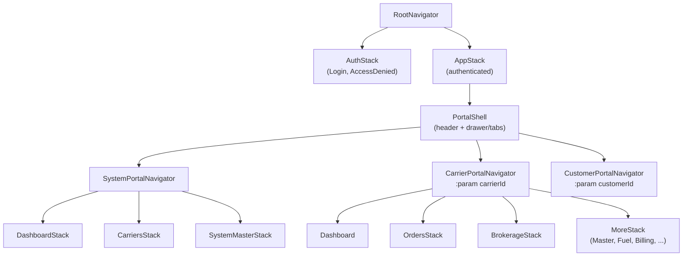

# Axis Hub Mobile — Multi-Portal Architecture

This document defines how the mobile app mirrors the web application's **single-app, multi-portal** model. On web, System Admin, Carrier (Tenant), and Customer portals coexist in one React SPA, coordinated by `authRoutes` in `AppRoutes.tsx`. Mobile follows the same model.

**Related:** [MOBILE_APP_DEVELOPMENT_PLAN.md](./MOBILE_APP_DEVELOPMENT_PLAN.md)

**Progress tracking:** Implement one checklist item at a time; mark `- [x]` when verified. See [Step-by-Step Workflow](./MOBILE_APP_DEVELOPMENT_PLAN.md#step-by-step-workflow) in the main plan.

---

## Table of Contents

1. [Concept](#concept)
2. [Web Reference](#web-reference)
3. [Portal Types](#portal-types)
4. [Mobile Equivalents](#mobile-equivalents)
5. [Source Code Location (`src/`)](#source-code-location-src)
6. [Route Configuration Model](#route-configuration-model)
7. [Navigation Tree](#navigation-tree)
8. [Portal Context State](#portal-context-state)
9. [Portal Switching UX](#portal-switching-ux)
10. [Permission Guards](#permission-guards)
11. [Post-Login Routing](#post-login-routing)
12. [Theming in Portals](#theming-in-portals)
13. [Deep Linking](#deep-linking)
14. [Implementation Checklist](#implementation-checklist)
15. [Portal Module Inventory](#portal-module-inventory)

---

## Concept

Axis Hub is **one application** serving **multiple entity types**, each with its own navigation shell:

| Portal | Web URL prefix | Entity ID param | Who uses it |
|--------|----------------|-----------------|-------------|
| **System (Admin)** | `/system/*` | — | Platform admins (`isSystemUser`) |
| **Carrier (Tenant)** | `/carriers/:carrierId/*` | `carrierId` → `tenantId` | Carrier staff, dispatchers, drivers |
| **Customer** | `/customers/:customerId/*` | `customerId` | End customers (planned) |

On web, the URL drives which portal is active. The sidebar shows only modules for the active portal. System users can switch between Admin Portal and any Carrier portal via the navbar dropdown.

**Mobile must replicate this:** one installed app, portal-aware navigation, permission-filtered menus, and explicit portal/tenant switching — without requiring separate apps per entity type.

---

## Web Reference

| Concern | Web file | Role |
|---------|----------|------|
| Route definitions | `frontend/src/routes/AppRoutes.tsx` | `authRoutes` — nested portal + module tree |
| Route type | `frontend/src/routes/RouteGuardRenderer.tsx` | `AuthRoute` interface |
| Permission guard | `RouteGuardRenderer` + `authHelper.ts` | Per-route `allowedSystemPermissions` / `allowedTenantPermissions` |
| Portal detection | `frontend/src/utils/pathnameContext.ts` | `PortalContext`: `system` \| `carriers` \| `customers` |
| Route filtering | `frontend/src/utils/navigation-helper.ts` | `filterRoutesByAuthorization`, `getDefaultRouteForUser` |
| Sidebar per portal | `frontend/src/components/Layouts/sidebar.tsx` | Finds active portal from URL, shows its `childRoutes` |
| Portal switcher | `frontend/src/components/Layouts/navbar.tsx` | Admin ↔ Carrier switch, tenant dropdown |
| Auth orchestration | `frontend/src/contexts/AuthContextProvider.tsx` | Session, profile, post-login redirect |

### Web `AuthRoute` shape (to mirror on mobile)

```typescript
interface AuthRoute {
  path: string;
  allowedSystemPermissions?: string[];
  allowedTenantPermissions?: string[];
  description: string;
  element: ReactElement;           // → screen component on mobile
  isShowOnSidebar: boolean;        // → show in drawer / tab bar
  showOnBreadcrumb?: boolean;
  icon?: LucideIcon;               // → tab/drawer icon
  portalIcon?: LucideIcon;         // → portal switcher icon
  title: string;
  isCollapsible?: boolean;         // → nested section in drawer
  childRoutes?: AuthRoute[];
}
```

---

## Portal Types

### 1. System Portal (Admin)

- **Web root:** `/system`
- **Title:** Admin Portal
- **Icon:** Shield
- **Top-level modules:** Dashboard, Carriers, Customers (system-level), System Master, System Secrets
- **Permissions:** `allowedSystemPermissions` (system user permissions)
- **Mobile priority:** Phase 3 — read-focused admin feature screens; full CRUD remains web-first

### 2. Carrier Portal (Tenant)

- **Web root:** `/carriers/:carrierId`
- **Title:** Carrier Portal
- **Icon:** Truck
- **Scoped by:** `tenantId` (from `:carrierId` URL segment)
- **Top-level modules:** Dashboard, Load Requests, Orders, Brokerage, Master, Materials, Fuel, FSC, Billing, Onboarding, Settings
- **Permissions:** Primarily `allowedTenantPermissions`; system users with `ANY` can access all
- **Mobile priority:** Phase 4 — primary operational feature screens (shell from Phase 2)

### 3. Customer Portal

- **Web root:** `/customers/:customerId` (defined in `pathnameContext.ts`)
- **Status on web:** Route tree **not yet in `authRoutes`** — infrastructure only
- **Scoped by:** `customerId`
- **Mobile priority:** Phase 5 — feature screens TBD when web routes land (shell from Phase 2)

---

## Mobile Equivalents

| Web mechanism | Mobile equivalent |
|---------------|-------------------|
| URL pathname (`/system/...`, `/carriers/5/...`) | `PortalContext` + navigation state (`portalContext`, `tenantId`, `customerId`) |
| `BrowserRouter` + nested `<Routes>` | React Navigation: root stack → portal navigators → module stacks |
| `authRoutes` array | `mobileAuthRoutes` config (same metadata, `screen` instead of `element`) |
| `RouteGuardRenderer` | `PortalGuard` HOC / screen `beforeRemove` + `useAuthorization` hook |
| `sidebar.tsx` (portal menu) | Per-portal **Drawer** or **bottom tabs** built from `childRoutes` where `isShowOnSidebar: true` |
| `navbar.tsx` (portal switcher) | **PortalSwitcher** header component (modal / bottom sheet) |
| `getPathnameContextData()` | `usePortalContext()` hook reading from `PortalContextProvider` |
| `filterRoutesByAuthorization()` | Same function — port from web |
| `getDefaultRouteForUser()` | `getDefaultPortalDestination()` — returns portal + screen |
| Hard refresh on tenant switch | Reset navigation state + invalidate React Query cache |

---

## Source Code Location (`src/`)

All portal-related code lives under **`axis_hub_mobile_app/src/`**:

| Area | Path |
|------|------|
| App entry | `src/app/App.tsx` |
| Portal navigators | `src/navigation/portals/` |
| Route config | `src/navigation/routes/` |
| Portal context | `src/navigation/PortalContextProvider.tsx` |
| Redux store | `src/redux/store.ts`, `src/redux/slices/`, `src/redux/actions/` |
| Portal switcher UI | `src/navigation/PortalSwitcher.tsx` |
| Portal shell layout | `src/components/layouts/PortalShell.tsx` |
| Screens | `src/screens/` — mirrors web `frontend/src/pages/` layout (filenames without `Screen` suffix) |
| Theme (light/dark) | `src/providers/ThemeProvider/`, `src/theme/` |

Import alias: `@/` → `src/` (e.g. `@/navigation/routes`).

See [MOBILE_APP_DEVELOPMENT_PLAN.md — Source Layout](./MOBILE_APP_DEVELOPMENT_PLAN.md#source-layout-src) for the full tree.

---

## Route Configuration Model

Create a single route config file that mirrors web structure (all under `src/navigation/`):

```
src/navigation/
├── routes/
│   ├── types.ts              # MobileAuthRoute (extends AuthRoute for RN)
│   ├── systemRoutes.ts       # System portal modules
│   ├── carrierRoutes.ts      # Carrier portal modules
│   ├── customerRoutes.ts     # Customer portal (stub)
│   └── index.ts              # mobileAuthRoutes = [system, carrier, customer]
├── guards/
│   ├── PortalGuard.tsx
│   └── useAuthorization.ts
├── PortalContextProvider.tsx
├── PortalSwitcher.tsx
├── buildPortalNavigator.tsx  # Config → React Navigation tree
└── RootNavigator.tsx
```

### `MobileAuthRoute` type

```typescript
import type { ComponentType } from 'react';

export type PortalContext = 'system' | 'carriers' | 'customers';

export interface MobileAuthRoute {
  /** Logical path — mirrors web for deep links & debugging */
  path: string;
  /** React Navigation screen name (camelCase) */
  screenName: string;
  allowedSystemPermissions?: string[];
  allowedTenantPermissions?: string[];
  description: string;
  /** Screen component */
  screen: ComponentType<any>;
  isShowOnSidebar: boolean;
  title: string;
  icon?: string;           // icon name for tab/drawer
  portalIcon?: string;
  isCollapsible?: boolean;
  /** Nested routes */
  childRoutes?: MobileAuthRoute[];
  /** Portal root only */
  portalContext?: PortalContext;
  /** Dynamic segment names, e.g. ['carrierId'] */
  pathParams?: string[];
}
```

### Design rules

1. **One config source** — portal modules defined once; navigators generated from config (same idea as web `flattenNavigationRoutes`).
2. **Path parity** — keep web path strings (e.g. `/carriers/:carrierId/load-orders/inbox`) for deep links and shared documentation.
3. **Incremental screens** — routes can reference `PlaceholderScreen` until implemented; permissions and menu structure stay complete.
4. **Do not duplicate permission keys** — import from `frontend/src/utils/constants/*` (copy or shared package).

---

## Navigation Tree



### Navigator responsibilities

| Navigator | When active | Params |
|-----------|-------------|--------|
| `AuthStack` | No valid session | — |
| `SystemPortalNavigator` | `portalContext === 'system'` | — |
| `CarrierPortalNavigator` | `portalContext === 'carriers'` | `carrierId: number` |
| `CustomerPortalNavigator` | `portalContext === 'customers'` | `customerId: number` |

Only **one portal navigator** is mounted at a time. Switching portals resets that navigator's stack (equivalent to web hard navigation).

---

## Portal Context State

Replace URL-derived context with explicit React state.

### `PortalContextProvider`

```typescript
interface PortalState {
  portalContext: PortalContext;
  tenantId: number;      // active carrier (0 if N/A)
  customerId: number;      // active customer (0 if N/A)
}

interface PortalContextValue extends PortalState {
  setPortal: (ctx: PortalContext, entityId?: number) => void;
  switchToSystemPortal: () => void;
  switchToCarrierPortal: (tenantId: number) => void;
  switchToCustomerPortal: (customerId: number) => void;
  getActivePortalRoute: () => MobileAuthRoute | undefined;
}
```

### Sync rules (mirror web)

| Event | Action |
|-------|--------|
| Login success | `getDefaultRouteForUser()` → set portal + entity ID |
| User opens Portal Switcher → Admin | `portalContext = 'system'`, navigate to system dashboard |
| User selects carrier | `portalContext = 'carriers'`, `tenantId = X`, reset carrier nav |
| Profile `activeTenantId` | Default carrier if user is carrier-only |
| API calls | Pass `tenantId` query param when profile tenant ≠ URL/context tenant (same as web `AuthContextProvider`) |
| Socket.IO | Handshake `{ token, tenantId }` using active `tenantId` |

### Persistence

Persist to secure/async storage:

- `portalContext`
- `tenantId` (when carriers)
- `customerId` (when customers)

Restore on cold start after session validation.

---

## Portal Switching UX

Mirror `navbar.tsx` behavior in a mobile header component.

### `PortalSwitcher` (header right)

**When `portalContext === 'carriers'`** (dropdown / bottom sheet):

1. Show current tenant name + "Carrier Portal"
2. **System users only:** "Switch to Admin Portal" → `/system/dashboard`
3. **Carriers section:** list `user.tenants` with checkmark on active tenant
4. On tenant select: dispatch `setCurrentTenant`, reset nav, reset relevant Redux slice state

**When `portalContext === 'system'`:**

1. Show "Axishub" + "Admin Portal"
2. **System users:** option to switch to last-used or first carrier tenant

**When `portalContext === 'customers'`** (future):

1. Show customer name + "Customer Portal"
2. List accessible customers if user has multiple

### Drawer / menu per portal

Equivalent to `sidebar.tsx` → `getSidebarRoutes()`:

```typescript
function getSidebarRoutes(
  routes: MobileAuthRoute[],
  portalContext: PortalContext,
  pathname: string, // or current navigation state
): MobileAuthRoute[] {
  const portal = routes.find((r) => r.portalContext === portalContext);
  const allowed = filterRoutesByAuthorization({ routes: portal?.childRoutes ?? [], ... });
  return allowed.filter((r) => r.isShowOnSidebar);
}
```

Render collapsible sections (`isCollapsible: true`) as expandable drawer groups — same as web Orders, Brokerage, Master, etc.

---

## Permission Guards

Port web `RouteGuardRenderer` logic:

```typescript
function PortalGuard({ route, children }: { route: MobileAuthRoute; children: React.ReactNode }) {
  const authorized = checkAuthorization({
    allowedSystemPermissions: route.allowedSystemPermissions,
    allowedTenantPermissions: route.allowedTenantPermissions,
  });

  if (!authorized) {
    return <AccessDeniedScreen />;
  }
  return <>{children}</>;
}
```

Apply at:

- **Navigator level** — omit screens user cannot access from generated navigator
- **Screen level** — guard direct deep links to unauthorized routes

Web reference: `checkAuthorization` in `frontend/src/utils/authHelper.ts`.

---

## Post-Login Routing

Port `getDefaultRouteForUser` from `navigation-helper.ts`:

| User type | Destination |
|-----------|-------------|
| Carrier-only (`activeTenantId`, not system admin) | `carriers` portal → `/carriers/{activeTenantId}/dashboard` |
| System user with permissions | First allowed route in `authRoutes` order (typically system dashboard) |
| Customer user (future) | `customers` portal → `/customers/{customerId}/dashboard` |

Mobile:

```typescript
function getDefaultPortalDestination(user: User, routes: MobileAuthRoute[]) {
  if (user.activeTenantId && (!user.isSystemUser || !user.systemPermissions?.length)) {
    return { portalContext: 'carriers', tenantId: user.activeTenantId, screen: 'CarrierDashboard' };
  }
  // system user — first authorized portal
  const allowed = filterRoutesByAuthorization({ routes, ... });
  const first = allowed[0];
  return resolvePortalFromRoute(first);
}
```

---

## Theming in Portals

Every portal shares the same **light / dark / system** theme — there is no per-portal theme. `PortalShell` and all portal screens consume `useTheme()` from `src/providers/ThemeProvider`.

| UI element | Theming |
|------------|---------|
| `PortalShell` header | `colors.background`, `colors.border` |
| Drawer / sidebar | `colors.sidebar`, `colors.sidebarForeground` (match web sidebar tokens) |
| `PortalSwitcher` | `colors.card`, `colors.primary` for active tenant |
| Tab bar (if used) | `navigationTheme.ts` via `NavigationContainer` |
| StatusBar | Updates when `resolvedTheme` changes |

Theme preference is global and persisted in AsyncStorage (`axis-ui-theme`). Settings screen in any portal can change it.

---

## Deep Linking

Map web URL patterns to portal context + screen:

| Web URL | Mobile deep link |
|---------|------------------|
| `/system/dashboard` | `axishub://system/dashboard` |
| `/carriers/42/load-orders/inbox/99` | `axishub://carriers/42/load-orders/inbox/99` |
| `/customers/7/orders` | `axishub://customers/7/orders` |

Implementation:

1. `linking` config in React Navigation
2. Parser sets `PortalContextProvider` state from URL segments
3. `PortalGuard` validates permissions before showing screen

---

## Implementation Checklist

Portal tasks mirror items in the main plan. Mark `- [x]` here **when that portal work is done**, and mark the matching item in [MOBILE_APP_DEVELOPMENT_PLAN.md](./MOBILE_APP_DEVELOPMENT_PLAN.md) too.

### Portal checklist progress

| Group | Done |
|-------|------|
| Phase 0–1 (Foundation + Auth) | 8 / 8 |
| Phase 2 (Portal shell) | 7 / 7 |
| Phase 3 (System portal features) | 11 / 13 |
| Phase 4 (Carrier portal features) | 0 / 15 |
| Phase 5 (Customer portal features) | TBD |

---

### Phase 0–1 (Foundation + Auth)

- [x] Define `MobileAuthRoute` type in `src/navigation/routes/types.ts`
- [x] Create `src/navigation/PortalContextProvider.tsx`
- [x] Port `pathnameContext` → `usePortalContext` in `src/hooks/`
- [x] Port `filterRoutesByAuthorization`, `getDefaultRouteForUser` to `src/utils/`
- [x] Stub `src/navigation/routes/systemRoutes.ts`, `carrierRoutes.ts`, `customerRoutes.ts`
- [x] `src/navigation/RootNavigator.tsx` with Auth vs App split
- [x] `src/redux/store.ts`, `authSlice`, `authActions`; `Provider` + `PersistGate` in `src/app/App.tsx`
- [x] `src/providers/ThemeProvider` + `src/theme/` (light / dark / system)

### Phase 2 (Portal shell)

- [x] `src/navigation/buildPortalNavigator()` — generate stacks from config
- [x] `src/components/layouts/PortalShell.tsx` — header, drawer, theme-aware chrome
- [x] `src/navigation/PortalSwitcher.tsx` component
- [x] Per-portal drawer with permission-filtered items
- [x] `src/navigation/guards/PortalGuard.tsx` on all authenticated screens
- [x] Placeholder screens for all top-level portal modules
- [x] Tenant list fetch (`fetchTenants`) + `setCurrentTenant` sync

### Phase 3 — System portal feature screens

- [x] Phase 3.1 — System dashboard (live KPIs)
- [x] Phase 3.2 — System carriers (list, detail, open carrier portal)
- [ ] Phase 3.3 — System customers (list, detail) — blocked: no system customer API on web/backend yet
- [x] Phase 3.4 — System master (users, roles)
- [x] Phase 3.5 — System secrets (read-only metadata)
- [ ] Deep linking config (system routes)

### Phase 4 — Carrier portal feature screens

- [ ] Phase 4.1 — Load orders (lists, detail, status updates, realtime)
- [ ] Phase 4.2 — Load requests & load board
- [ ] Phase 4.3 — Billing, settlement & documents
- [ ] Phase 4.4 — Onboarding & settings extensions
- [ ] Deep linking config (carrier routes)

### Phase 5 — Customer portal feature screens

- [ ] Details TBD when web `authRoutes` customer tree lands

---

## Portal Module Inventory

Synced with `frontend/src/routes/AppRoutes.tsx` (`authRoutes`). Mobile implements screens incrementally; all modules should exist in route config from Phase 2.

### System Portal (`/system`)

| Module | Web path | Mobile phase |
|--------|----------|--------------|
| Dashboard | `/system/dashboard` | Phase 3.1 |
| Carriers | `/system/carriers/*` | Phase 3.2 |
| Customers (system) | `/system/customers/*` | Phase 3.3 |
| System Master | `/system/master/*` (users, roles) | Phase 3.4 |
| System Secrets | `/system/secrets` | Phase 3.5 |

### Carrier Portal (`/carriers/:carrierId`)

| Module | Web path | Mobile phase |
|--------|----------|--------------|
| Dashboard | `.../dashboard` | Phase 2 (shell) |
| Load Requests | `.../load-requests` | Phase 4.2 |
| Orders | `.../load-orders/*` | Phase 4.1 |
| Brokerage | `.../brokerage/*` | Phase 4.2 |
| Master | `.../master/*` | Phase 6+ |
| Materials | `.../materials/*` | Phase 6+ |
| Fuel | `.../fuel/*` | Phase 6+ |
| FSC | `.../fsc/*` | Phase 6+ |
| Billing | `.../billing/*` | Phase 4.3 |
| Onboarding | `.../onboarding` | Phase 4.4 |
| Settings | `.../settings` | Phase 2 (profile/theme) |

### Customer Portal (`/customers/:customerId`) — planned

| Module | Web path | Mobile phase |
|--------|----------|--------------|
| Feature screens | `/customers/:customerId/*` | Phase 5 (details TBD) |

---

## Document History

| Date | Version | Notes |
|------|---------|-------|
| 2026-07-01 | 1.0 | Initial multi-portal architecture |
| 2026-07-01 | 1.2 | `src/` paths; theming; `src/redux/` |
| 2026-07-01 | 1.3 | Step-by-step workflow; checklist progress tables |
| 2026-07-01 | 1.4 | Restructured Phases 3–5: System (3), Carrier (4), Customer (5) |
